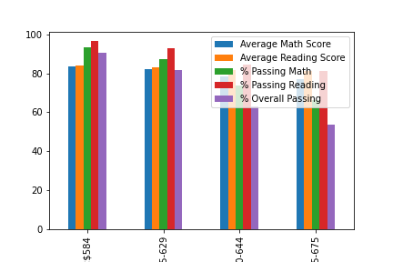
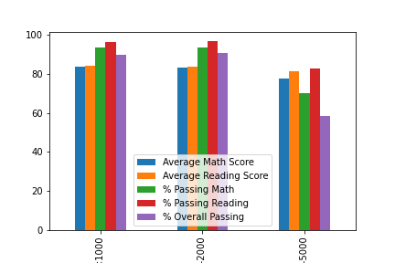
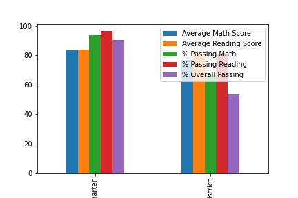

# Panda-PyCitySchools Challenge 


## Background

We will be helping a school board make strategic decisions regarding future school budgets and priorities.

by analyzing the district-wide standardized test results. Youhave access to every student's math and reading
scores, as well as various information on the schools they attend. Using the pandas library and Jupyter Notebook. 
We are going to aggregate the data to showcase obvious trends in school performance.

## Analysis

our final report include each of the following:

### District Summary

* Created a high level snapshot (in table form) of the district's key metrics, including:
  * Total Schools
  * Total Students
  * Total Budget
  * Average Math Score
  * Average Reading Score
  * % Passing Math (The percentage of students that passed math.)
  * % Passing Reading (The percentage of students that passed reading.)
  * % Overall Passing (The percentage of students that passed math **and** reading.)

```text

Total Schools  Total Students  Total Budget   Average Math Score  Average Reading Score  %Passing Math  %Passing Reading  %Over all Passing
    15	          39,170       $24,649,428.00	   78.99	         81.88	             74.98 %	    85.81 %	     65.17 %
```

### School Summary

* Created an overview table that summarizes key metrics about each school, including:
  * School Name
  * School Type
  * Total Students
  * Total School Budget
  * Per Student Budget
  * Average Math Score
  * Average Reading Score
  * % Passing Math (The percentage of students that passed math.)
  * % Passing Reading (The percentage of students that passed reading.)
  * % Overall Passing (The percentage of students that passed math **and** reading.)

```
School Name	    School Type	 Total Students	Total School Budget  Per Student Budget	Average Math Score  Average Reading Score  %Passing Math  %Passing Reading  %Overall Passing
Bailey High School	District    4976	  $3,124,928.00	     $628.00	          77.05	             81.03	            66.68 %	   81.93 %	     54.64 %
Cabrera High School	Charter	    1858	  $1,081,356.00	     $582.00	          83.06	             83.98	            94.13 %	   97.04 %	     91.33 %	
```

### Top Performing Schools (By % Overall Passing)

* Created a table that highlights the top 5 performing schools based on % Overall Passing. Include:
  * School Name
  * School Type
  * Total Students
  * Total School Budget
  * Per Student Budget
  * Average Math Score
  * Average Reading Score
  * % Passing Math (The percentage of students that passed math.)
  * % Passing Reading (The percentage of students that passed reading.)
  * % Overall Passing (The percentage of students that passed math **and** reading.)

```
School Name	      School Type  Total Students  Total School Budget	Per Student Budget  Average Math Score	Average Reading Score  %Passing Math  %Passing Reading  %Overall Passing
Cabrera High School	Charter	    1858	     $1,081,356.00	$582.00	                83.06	           83.98	            94.13 %	    97.04 %	   91.33 %
Thomas High School	Charter	    1635	     $1,043,130.00	$638.00	                83.42	           83.85	            93.27 %	    97.31 %	   90.95 %
Griffin High School	Charter	    1468	     $917,500.00	$625.00	                83.35	           83.82	            93.39 %	    97.14 %	   90.60 %
Wilson High School	Charter	    2283	     $1,319,574.00	$578.00	                83.27	           83.99	            93.87 %	    96.54 %	   90.58 %
Pena High School	Charter	    962	             $585,858.00	$609.00	                83.84	           84.04	            94.59 %	    95.95 %	   90.54 %
```

### Bottom Performing Schools (By % Overall Passing)

* Create a table that highlights the bottom 5 performing schools based on % Overall Passing. 
Include all of the same metrics as above.

```
School Name	       School Type  Total Students  Total School Budget	Per Student Budget  Average Math Score	Average Reading Score  %Passing Math  %Passing Reading	%Overall Passing
Rodriguez High School	District	3999		$2,547,363.00    $637.00		76.84			80.74		 66.37 %	  80.22 %		52.99 %
Figueroa High School	District	2949		$1,884,411.00	 $639.00		76.71			81.16		 65.99 %	  80.74 %		53.20 %
Huang High School	District	2917		$1,910,635.00	 $655.00		76.63			81.18		 65.68 %	  81.32 %		53.51 %
Hernandez High School	District	4635		$3,022,020.00	 $652.00		77.29			80.93		 66.75 %	  80.86 %		53.53 %
Johnson High School	District	4761		$3,094,650.00	 $650.00		77.07			80.97		 66.06 %	  81.22 %		53.54 %
```

### Math Scores by Grade

* Created a table that lists the average Math Score for students of each grade level (9th, 10th, 11th, 12th) at each school.

```
school_name		9th	10th	11th	12th
Bailey High School	77.08	77.00	77.52	76.49
Cabrera High School	83.09	83.15	82.77	83.28
Figueroa High School	76.40	76.54	76.88	77.15
Ford High School	77.36	77.67	76.92	76.18
Griffin High School	82.04	84.23	83.84	83.36
```

### Reading Scores by Grade

* Create a table that lists the average Reading Score for students of each grade level (9th, 10th, 11th, 12th) at each school.

```
school_name		9th	10th	11th	12th
Bailey High School	81.30	80.91	80.95	80.91
Cabrera High School	83.68	84.25	83.79	84.29
Figueroa High School	81.20	81.41	80.64	81.38
Ford High School	80.63	81.26	80.40	80.66
Griffin High School	83.37	83.71	84.29	84.01
```

### Scores by School Spending

* Create a table that breaks down school performances based on average Spending Ranges (Per Student). Use 4 reasonable bins to group school spending. Include in the table each of the following:
  * Average Math Score
  * Average Reading Score
  * % Passing Math (The percentage of students that passed math.)
  * % Passing Reading (The percentage of students that passed reading.)
  * % Overall Passing (The percentage of students that passed math **and** reading.)

#### <a id="school-spending"></a>School Spending



### Scores by School Size

* Repeat the above breakdown, but this time group schools based on a reasonable approximation of school size (Small, Medium, Large).

#### <a id="school-size"></a>School Size



### Scores by School Type

* Repeat the above breakdown, but this time group schools based on school type (Charter vs. District).

#### <a id="school-type"></a>School Type



## Conclusion

Looking at the the plots created after each analysis, it is obvious that:

 * Spending more money per-student did not improve grades at all. Schools with smaller budgets (585 per student)
 dramatically out-performed schools with higher spending (645-675 per student) on overall passing percentage (90% passing vs 53%).

 * Small class size means better grades and that is why smaller and medium sized schools dramatically 
out-performed large sized schools on overall passing percentage (90% passing vs 58%).

 * Charter schools grade-average way better than District or public schools, this is very clear when 
we look at top five performing schools"all Charters" vs bottom five ones"all District".

 * Charter schools kids out perform their District counterpart by 37% points when it comes to the 
overall percentage of passing both math and reading (90% vs 53%).


